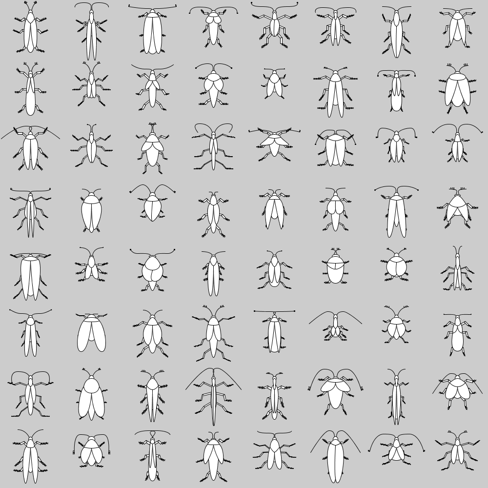
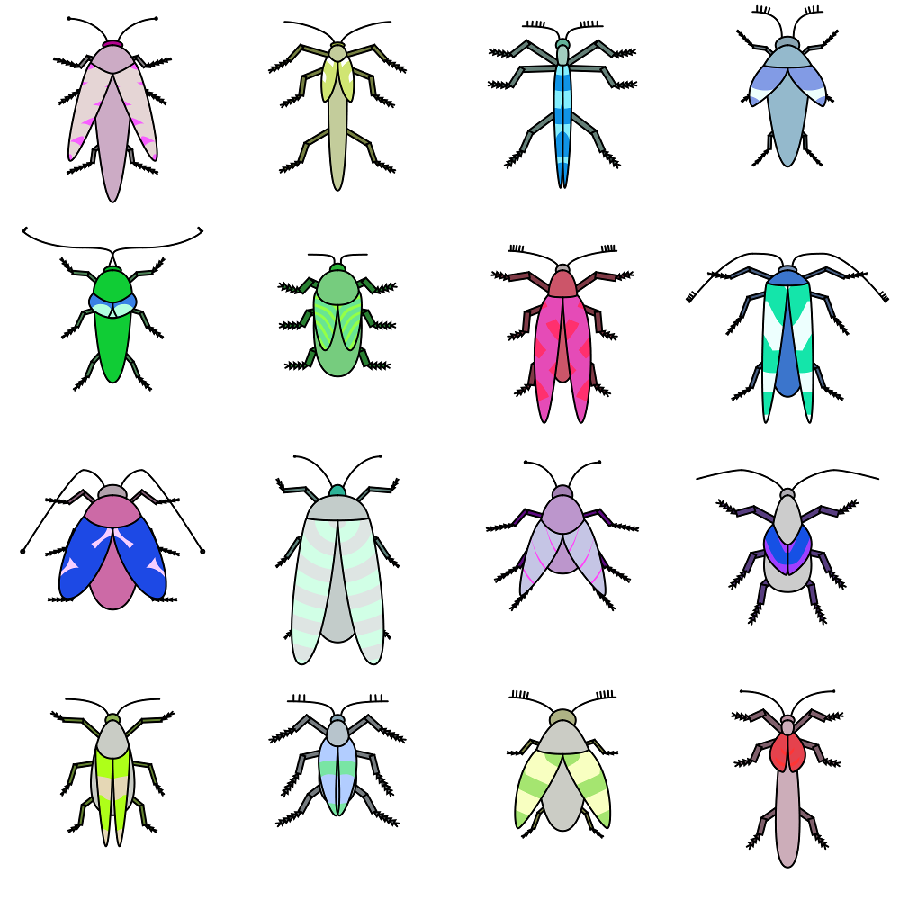

# generativeBugs
Processing script for generating random bug images.



Create a new Bug by creating a Object
```
Beetle b = new Beetle();
```

You can choose if the bug should be colored or not in the constructor (colored is default).
```
Beetle b = new Beetle(false);
```

To draw your bug, get the Image from the bug and draw it on your canvas:
```
Beetle b = new Beetle();
image(b.getImage(),0,0,500,500);
```

A bug generated 1-2 attributes which you can get by using the name attribute:
```
Beetle b = new Beetle();
System.out.println(b.name);
```
